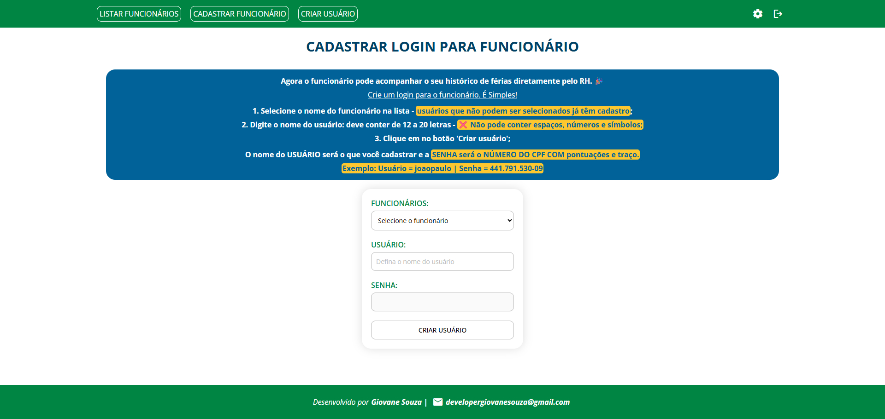

# Sistema de Controle de Férias (Front-end)

## ℹ️ Sobre

Trata de uma aplicação para Controle de Férias de Funcionários de uma das unidades do `Posto BR`, localizada no município de Cabo de Santo Agostinho/PE, `realizado como parte de atividades extensionistas (PEX) em alinhamento com o Objetivo de Desenvolvimento Sustentável (ODS) 8 da ONU`: **"Trabalho decente e crescimento econômico"**. **O projeto teve como foco proporcionar melhorias na organização e gestão dos recursos humanos, promovendo práticas mais eficientes, transparentes e sustentáveis no ambiente de trabalho**.
O sistema foi desenvolvido utilizando tecnologias de código aberto e plataformas gratuitas, visando acessibilidade e sustentabilidade financeira para a organização.

> Projeto desenvolvido como parte avaliativa da disciplina `PROJETO DE EXTENSÃO V`, do curso de `ADS`.


## 💻 Tecnologias e ferramentas utilizadas


## 🧪 Testes Automatizados com Cypress

Com o objetivo de garantir a qualidade, confiabilidade e estabilidade do sistema, foi implementada uma suíte de testes automatizados end-to-end utilizando Cypress.

### 🔍 O que foi testado?

- Fluxo de login

- Cadastro, busca, edição e exclusão de funcionários
- Criação, listagem
- Comportamentos de UI, validações e mensagens de erro
- Garantia de que processos críticos funcionem corretamente em diferentes cenários

### 🚀 Benefícios alcançados

- Redução de falhas manuais em deploys
- Feedback rápido sobre regressões
- Segurança ao atualizar funcionalidades
- Automação repetível que acompanha o crescimento do projeto

Os testes foram estruturados seguindo boas práticas, com reutilização de comandos personalizados, cenários independentes e padronização de seletores para facilitar manutenção.


## Pré-requisitos para executar a aplicação

Antes de utilizar o projeto, certifique-se de seguir as seguintes etapas:

- [x] **Ter o Git instalado na máquina.**
- [x] **Ter o Node.js instalado.**
- [x] **Ter um editor de código de sua preferência.**
- [x] **Ter clonado e executado o repositório do back-end, disponível [aqui](https://github.com/giovanesouza/posto-br-rh-backend).**
- [x] **Clonar este repositório com o comando abaixo:**

  ```shell
  https://github.com/giovanesouza/posto-br-rh.git
  ```

## ⚙️ Configurações necessárias

Com o repositório clonado, execute os seguintes comandos no diretório do projeto:

- **Para baixar as dependências**:

  ```shell
  npm install
  ```

>[!IMPORTANT]
>
> Antes de iniciar este projeto, todas as configurações da aplicação do back-end devem estar concluídas.

- **Para iniciar a aplicação**:

  ```shell
  npm run dev
  ```

## ✅ Resultados obtidos


### Login

https://github.com/user-attachments/assets/ae48a90e-cca1-4dd2-a96c-88530b3f82e4

### Cadastro e busca de funcionários

https://github.com/user-attachments/assets/3f8b50a7-db31-4ef1-bf60-f46b948d26c0

### Atualização e exclusão de funcionários

https://github.com/user-attachments/assets/908991f9-8475-438a-95aa-f782dacb78c3

### Criação, listagem, atualização e exclusão de férias

https://github.com/user-attachments/assets/82a51d58-e4a7-431c-ac72-9326b7183583

### Atualização de usuário

https://github.com/user-attachments/assets/c3efcbbf-8d31-483e-936c-ab45b93dfdbe

### Responsividade

https://github.com/user-attachments/assets/8a818b13-ac03-4687-8221-aa2fffe87b24


### 🆕 Página para cadastro de usuários

Agora os funcionários podem ter um login e acompanhar o histórico das suas férias.




